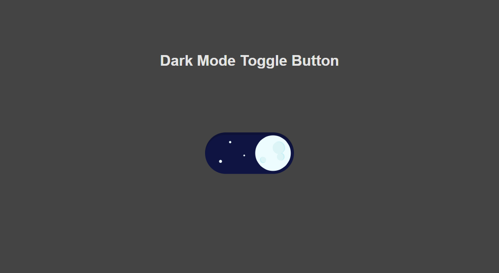

# Dark Mode Toggle
A simple toggle button, which can be used in any context. I've used the animation data from [cawfree/react-dark-mode-toggle](https://github.com/cawfree/react-dark-mode-toggle), which only supports react. This project should allow the usage of the great animation in non-react enviroments. In addition I've added a very basic implementation for swapping dark/ light themes.

 

## Libraries
 * AnimationData [cawfree/react-dark-mode-toggle](https://github.com/cawfree/react-dark-mode-toggle)
 * Player [LottieFiles/lottie-player](https://github.com/LottieFiles/lottie-player)
 * Github Corners [github.com/remarkablemark/github-corners](https://github.com/remarkablemark/github-corners)
